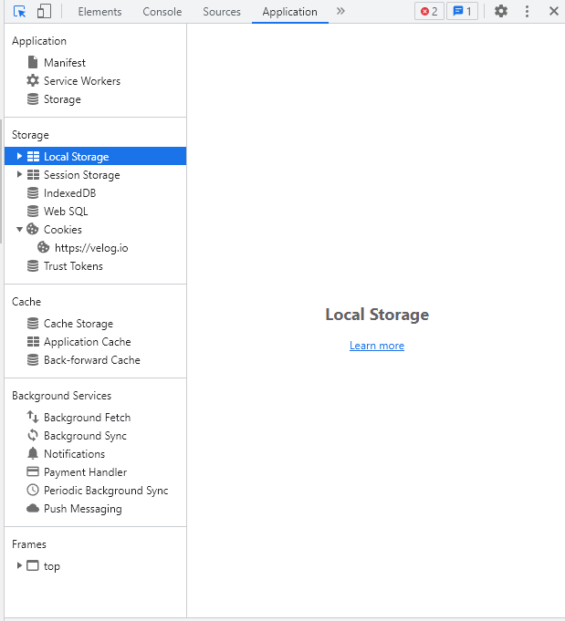

## Checklist

### 관심사의 분리 원칙이란 무엇인가요? 웹에서는 이러한 원칙이 어떻게 적용되나요?
관심사의 분리 원칙(Separation of Concerns, SoC)은 원칙은 프로그램을 하나의 단일 블록으로 작성하지 말고 작은 조각으로 나누어 각각 간단한 개별 작업을 완료할 수 있도록 만드는 것을 말한다.  
관심사의 분리(SoC)는 소프트웨어 개발에서 가장 기본적인 원칙 중 하나이며, SOLID 원칙 5개 중 2개(단일 책임 및 인터페이스 분리)가 이 개념에서 직접 파생될 정도로 매우 중요하다.  
관심사의 분리 원칙을 준수하면 코드의 다양한 특성을 개선할 수 있다.
* 더 나은 코드 명료성: 각 모듈이 논리적으로 범위가 지정된 일련의 메소드를 가진 간결하고 명확한 API를 가질 때 프로그램에서 어떤 일이 벌어지는지 이해하는 것이 훨씬 더 쉽다.
*  코드 재사용성 향상(DRY 원리): 코드를 재사용성이 향상되어 주된 이점은 유지관리 비용이 절감된다.
*  더 나은 테스트 가능성: 적절한 범위의 기능과 앱의 나머지 부분으로부터 격리된 독립 모듈을 테스트하는 것이 더 쉽다. 모듈이 어떻게 작동하는지 보기 위해 전체 환경을 파악할 필요는 없다. 인접한 실제 모듈을 더미 mock 또는 가짜 데이터 소스로 교체하기만 하면 충분하다. 이렇게 수정한 후 출력하여 모듈을 블랙박스로 테스트하거나 연결된 모듈(BDD)에서 호출되는 메서드를 확인하여 화이트박스로 테스트할 수 있다.
* 프로젝트 개발 및 유지보수 성능 향상: 새로운 기능이든 기존 기능이든 모듈 격리는 프로그램의 변경사항으로 영향을 받을 수 있는 영역을 범위를 지정하는 데 도움이 되며, 따라서 개발 속도가 빨라진다.
* 여러 엔지니어에 의한 동시 개발이 더 용이: 모듈의 API 업데이트만이 다른 개발자에게 명시적으로 알리는 플래그가 될 수 있으며, 대부분의 변경사항은 다른 제공자의 즉각적인 주의 없이 추가할 수 있다. 우수한 테스트 적용 범위와 결합되면 병렬 개발은 단독으로 작업하는 각 개별 엔지니어의 누적 생산성만큼 효율적이 된다(보통 더 느림).
  
웹에서는 관심사 분리 원칙을 구현하기 위해 단일 책임 원칙, 개방-폐쇄 원칙, 인터페이스 분리 원칙을 달성할 수 있다.
* application의 functional programming(class)를 통해 각각의 동작이 OOP의 기본적인 분리원칙을 준수하고 있는지 파악이 가능하다.
* unit test를 통한 동작 확인이나, 이러한 확인 과정을 통해 객체지향 프로그래밍이 잘 진행되고 있는지 확인할 수 있다.

### 객체지향의 SOLID 원칙이란 무엇인가요? 이 원칙을 구체적인 예를 들어 설명할 수 있나요?
* 단일 책임 원칙 (Single Responsiblity Principle)
    * 모든 클래스는 각각 하나의 책임만 가져야 한다. 클래스는 그 책임을 완전히 캡슐화해야 함을 말한다.
    * 사칙연산 함수를 가지고 있는 계산 클래스가 있을 때, 이 상태의 계산 클래스는 오직 사칙연산 기능만을 책임진다. 이 클래스를 수정한다고 한다면 그 이유는 사직연산 함수와 관련된 문제일 뿐이다.
* 개방-폐쇄 원칙 (Open Closed Principle)
    * 확장에는 열려있고 수정에는 닫혀있는. 기존의 코드를 변경하지 않으면서( Closed), 기능을 추가할 수 있도록(Open) 설계가 되어야 한다는 원칙을 말한다.
    * 캐릭터를 하나 생성한다고 할 때, 각각의 캐릭터가 움직임이 다를 경우 움직임의 패턴 구현을 하위 클래스에 맡긴다면 캐릭터 클래스의 수정은 필요가없고(Closed) 움직임의 패턴만 재정의 하면 된다.(Open)
* 리스코프 치환 원칙 (Liskov Substitution Principle)
    * 자식 클래스는 언제나 자신의 부모 클래스를 대체할 수 있다는 원칙이다. 즉 부모 클래스가 들어갈 자리에 자식 클래스를 넣어도 계획대로 잘 작동해야 한다.
    *
* 인터페이스 분리 원칙 (Interface Segregation Principle)
    * 한 클래스는 자신이 사용하지 않는 인터페이스는 구현하지 말아야 한다. 하나의 일반적인 인터페이스보다 여러 개의 구체적인 인터페이스가 낫다.
    * 범용 인터페이스로 인해 여러 클라이언트(클래스)가 영향을 받기 보다는, 개별적인 클라이언트에 특화되어 서로의 영향을 최소화할 수 있도록 구성한다.
* 의존 역전 원칙 (Dependency Inversion Principle)
    * 불가피한 의존관계를 형성할 때는 거의 변화하지 않는 객체, 변하기 어려운 객체에 의존하도록 설정한다.
    * 의존관계란 한 클래스가 동작을 수행할 때 다른 클래스의 영향을 받는 경우를 말하며, 기본적으로 OOP는 이러한 의존관계를 최소화해야 한다.
### 로컬 스토리지란 무엇인가요? 로컬 스토리지의 내용을 개발자 도구를 이용해 확인하려면 어떻게 해야 할까요?
웹사이트의 `cookie`, `session`과 같은 정보들을 개인PC의 라이브러리 등 특정 공간에 저장하면서 사용자 맞춤적인 사이트 구동에 참조하는 저장소를 말한다.  
해당 정보들이 저장되어있는 공간에서 웹사이트가 참조하여, 사용자가 방문했던 이력 및 관심사 등을 파악하고 이를 이후 동작에서 활용한다.

