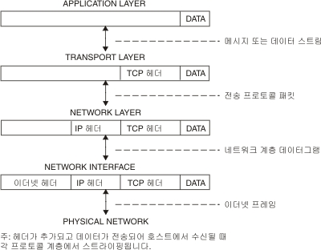

## Checklist

### 인터넷은 어떻게 동작하나요? Internet Protocol Suite의 레이어 모델에 입각하여 설명해 보세요.
`Internet Protocol Suite`는 TCP와 IP가 가장 많이 쓰이기 때문에 `TCP/IP Protocol Suite`라고도 불린다.  

`Protocol`은 시스템과 애플리케이션 프로그램에서 정보를 교환할 수 있도록 하는 메시지 형식 및 프로시저에 대한 규칙 세트이다.  수신 호스트가 메시지를 이해하려면 통신에 관련된 각 시스템이 이러한 규칙을 준수해야 한다. `TCP/IP Protocol Suite`는 계층(또는 레벨)이라는 관점에서 이해할 수 있다.  


우선 애플리케이션 프로그램은 메시지나 데이터 스트림을 인터넷 전송 계층 프로토콜인 `UDP(User Datagram Protocol)` 또는 `TCP(Transmission Control Protocol)` 중 하나로 전송한다.  
해당 프로토콜은 애플리케이션으로부터 데이터를 수신하고 이를 패킷이라 부르는 보다 작은 조각으로 나누어 대상 주소를 추가한 후 다음 프로토콜 계층인 인터넷 네트워크 계층을 따라 패킷을 패스한다.  

`인터넷 네트워크 계층`은 패킷을 IP(인터넷 프로토콜) 데이터그램에 포함한 후 데이터그램 헤더 및 트레일러에 넣고 데이터그램 전송 위치(대상에 직접 또는 게이트웨이에)를 결정한 후 네트워크 인터페이스 계층으로 데이터그램을 패스한다.  

`네트워크 인터페이스 계층`은 IP 데이터그램을 승인하고 이더넷이나 토큰 링 네트워크와 같은 특정 네트워크 하드웨어를 통해 이들을 프레임으로 전송한다.  

### 근거리에서 서로 떨어진 두 전자기기가 유선/무선으로 서로 통신하는 프로토콜은 어떻게 동작할까요?
* 근거리에 놓여진 두 기기의 네트워크 대역은 보통 정적 라우팅을 통해 연결하며, 라우팅테이블에 저장된 두 기기의 IP와 PORT 정보를 통해 데이터 전달이 이루어진다.
* 와이파이를 통해 연결한다면 무선 공유기를 통한 라우팅을 진행할 것이고, 블루투스를 통해 연결한다면 BLE stack 프로토콜을 기반으로 통신을 진행할 것이다.  

### 근거리에 있는 여러 대의 전자기기가 서로 통신하는 프로토콜은 어떻게 동작할까요?

### 아주 멀리 떨어져 있는 두 전자기기가 유선/무선으로 서로 통신하는 프로토콜은 어떻게 동작할까요?
* 사용하는 프로토콜은 두 기기간 거리보다는, 두 기기가 네트워크를 어떤 형태를 통해 연결하였으며 어떤 통신규약을 채용하고 있는지에 영향을 받는다.
* 보통 멀리 떨어져 있는 기기의 경우엔 근거리 대역의 네트워크가 없어 라우팅 테이블 작성이 어려우므로, 인터넷과 같이 Hob(지역 통신사)를 통한 데이터 전달이 이루어진다.  

### 두 전자기기가 신뢰성을 가지고 통신할 수 있도록 하기 위한 프로토콜은 어떻게 동작할까요?
* 웹과 사용자간의 대표적인 통신규약인 HTTP는, SSL인증을 적용한 HTTPS 프로토콜을 사용한 것이 가장 대표적인 보안적용의 예이다.
* HTTP프로토콜을 통한 데이터통신 과정에 SSL/TLS 암호화 방식(양방향 암호화)을 적용하여 상대적으로 안전한 데이터 전달이 가능하도록 한 방식이다.  

### HTTP는 어떻게 동작할까요?
1. 브라우저는 DNS 서버로 가서 그 주소에 해당하는 ip주소를 찾아서 이를 받아온다.
2. 목적지의 ip를 알게 되었으니 TCP 통신을 통해서 소켓을 개방한다.
3. 브라우저는 해당 사이트의 사본을 클라이언트에게 보내달라는 HTTP 요청 메시지를 서버로 전송한다.
4. 만약 라우팅 중 프록시 서버를 만나는 경우 웹 캐시에 저장된 정보를 응답 받게 된다.
5. 프록시 서버를 만나지 못하여 특정 URL을 서빙하는 서버에 도달하게 되어 이 메세지를 받은 서버는 클라이언트의 요청을 승인하고, 요청에 맞는 데이터를 전송한다.
6. 서버는 웹사이트의 파일들을 데이터 패킷으로 브라우저에 전송하고, 브라우저의loader는 해당 응답을 다운로드할 지 결정한다.
7. 브라우저는 패킷들을 완전한 웹 사이트로 조립한 뒤 그를 보여준다.  

### 우리가 브라우저의 주소 창에 www.knowre.com 을 쳤을 때, 어떤 과정을 통해 서버의 IP 주소를 알게 될까요?
1. 브라우저의 URL 파싱: URL을 입력받은 브라우저는 URL의 구조를 해석한다.
2. HSTS 목록 조회  
	`HSTS(HTTP Strict Transport Security)` 웹 브라우저가 HTTPS 프로토콜만을 사용해서 서버와 통신하도록 하는 기능이다.  
	일정시간동안 HSTS 응답을 받은 웹사이트에 대해서 https 접속을 강제화하고 HTTPS 접속이 실패하는 경우 사이트 접근에 실패하게 된다.  
	이를 통해 브라우저에서는 이 HSTS 목록 조회를 통해 해당 요청을 HTTPS로 보낼지 판단한다.  
	HSTS목록에 해당 URL이 존재한다면 명시적으로 HTTP를 통해 요청한다. 해도 브라우저가 이를 HTTPS로 요청한다.  

3. URL을 IP주소로 변환
    브라우저에서는 자신의 로컬 hosts 파일과 브라우저 캐시에 해당 URL이 존재하는지 확인한다. 존재하지 않는다면 도메인 주소를 IP주소로 변환해주는 DNS(Domain Name System) 서버에 요청하여 해당 URL을 IP주소로 변환한다. 
```
DNS 서버로 요청하는 과정
1. 미리 설정 된 Local DNS에 해당 URL 주소의 IP주소를 요청한다
2. Local DNS에 해당 IP주소가 존재한다면 이를 응답하고, 없다면 다른 DNS 서버와 통신한다. root DNS 서버에 해당 URL의 IP주소를 요청한다.
3. root DNS서버에 해당 IP주소가 없다면 하위 DNS 서버에 요청하라고 응답한다. 이 응답을 받은 Local DNS는. net 도메인을 관리하는 DNS 서버에  같은 내용을 요청한다.
4. .net DNS 서버에 해당 IP주소가 없다면 하위 DNS 서버에 요청하라고 응답합니다. 이 응답을 받은 Local DNS는 daum.net 도메인을 관리하는 DNS 서버에 같은 내용을 요청한다.
5. daum.net DNS 서버에서 IP주소를 응답받은 Local DNS는 해당 IP주소를 캐싱하고 응답한다.
```  

* [TCP/IP 프로토콜](https://www.ibm.com/docs/ko/aix/7.1?topic=protocol-tcpip-protocols)  
* [네트워크/프로토콜](https://velog.io/@gyrbs22/WebDevCurriculum-33z27gmu)
* [ 어떻게 DNS 서버가 IP 주소를 조회할까](https://hoyeonkim795.github.io/posts/DNS%EC%84%9C%EB%B2%84%EC%99%80_IP%EC%A3%BC%EC%86%8C/)
* [브라우저에 URL을 입력했을 때 발생하는 일들](https://deveric.tistory.com/97)